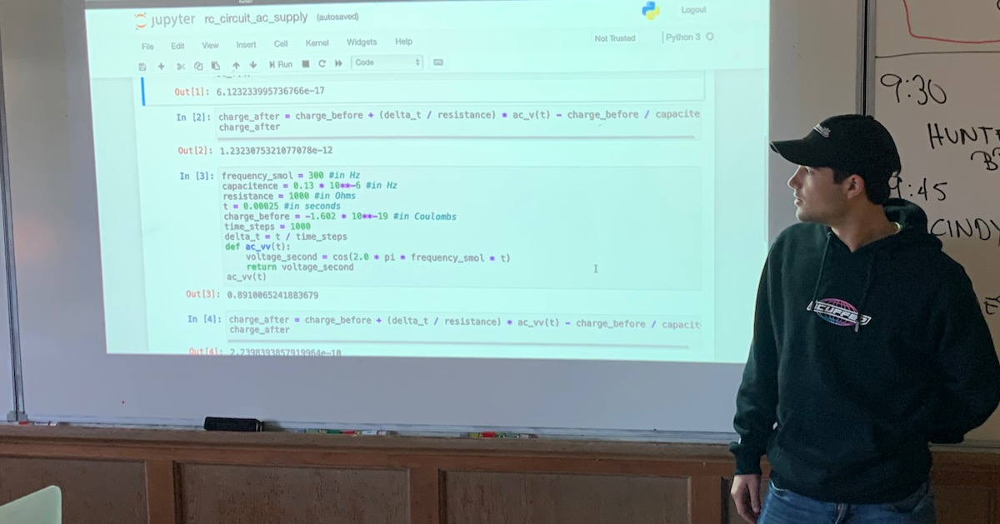

## Hunter &mdash; RC Circuit with AC Supply

With the resistor-capacitor combination, we can swap out the DC (direct current) voltage source and put in an AC (alternating current) voltage source.

The resistor-capacitor combination is called an "RC" circuit.

I'll be doing an RC circuit with an AC voltage source. It turns out you can make both a low-pass filter and a high-pass filter out of an RC circuit.

The Jupyter notebook will study high-pass and low-pass filters made from RC circuits.

### Links

* [RC Circuit with AC Supply Notebook](./rc_circuit_ac_supply.ipynb)
* Return to [Teams](../teams.md)

### Hunter Standup 1

First steps will be to code up the alternating current function.

### Hunter Standup 2

Yesterday got all the formulas and values into the code. Alternating current function. 1000 Hz is the medium frequency.

Low frequency (200 Hz), medium frequeny, and high frequency (5000 Hz).

### Final Presentation Feedback

#### Something  valuable you learned, about the topic, the model, the code, or admired about the presentation itself:

&nbsp;

&nbsp;

&nbsp;

&nbsp;

&nbsp;

#### Something that could have been clearer or more impactful:

&nbsp;

&nbsp;

&nbsp;

&nbsp;

&nbsp;

#### Overall impression (circle one only):

Needs more work

Good

Impressive

Very Impressive

#### REVIEWER NAME:

&nbsp;

&nbsp;

REVIEWER NAME WILL BE REMOVED/ANONYMIZED BEFORE DELIVERY TO TEAM
