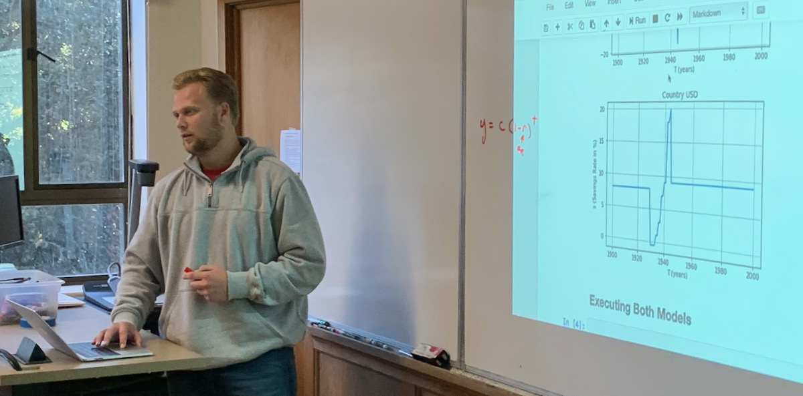

## Mackade &mdash; Extending Solow-Swan

Extending the Solow-Swan economic model.

### Links

* [Extending Solow-Swan Notebook](./extending_solo_swan.ipynb)
* Return to [Teams](../teams.md)

### Mackade Standup 1

Andras's model is pretty naive. Make it more realistic or more interactive. Start by adding two countries instaead of 1.
Next steps: A. Talk to Andras. B. Add a second coutnry to the plot.

### Mackade Standup 2

Yesterday got a second country into the notebook.

Investigating the Ramsey-Cass-Koopman extension of Solow-Swan.

Add variable savings rate -- put in some big changes during and after WWWII. Haven't got feedback from Andras (external dependency)

### Final Presentation Feedback

#### Something  valuable you learned, about the topic, the model, the code, or admired about the presentation itself:

&nbsp;

&nbsp;

&nbsp;

&nbsp;

&nbsp;

#### Something that could have been clearer or more impactful:

&nbsp;

&nbsp;

&nbsp;

&nbsp;

&nbsp;

#### Overall impression (circle one only):

Needs more work

Good

Impressive

Very Impressive

#### REVIEWER NAME:

&nbsp;

&nbsp;

REVIEWER NAME WILL BE REMOVED/ANONYMIZED BEFORE DELIVERY TO TEAM
