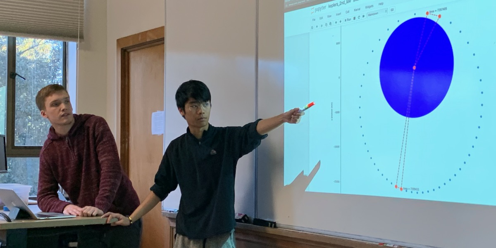

## Matt and Nicolo &mdash; Kepler's 2nd Law

Proving that Kepler's 2nd Law (equal areas in equal times) works.

Produce a visualization of the equal areas law of Kepler's three laws.

Start from the Newton's Cannon notebook.

### Links

* [Kepler's 2nd Law Notebook](./keplers_2nd_law.ipynb)
* Return to [Teams](../teams.md)

### Matt and Nicolo Standup 1

Uncertainties: how to show the graphs.

Finding the area for a non-right triangle will be a bit of a challenge.

### Matt and Nicolo Standup 2

Triangles are nicely drawn.

Have good new function that solves area problem.

### Final Presentation Feedback

#### Something  valuable you learned, about the topic, the model, the code, or admired about the presentation itself:

&nbsp;

&nbsp;

&nbsp;

&nbsp;

&nbsp;

#### Something that could have been clearer or more impactful:

&nbsp;

&nbsp;

&nbsp;

&nbsp;

&nbsp;

#### Overall impression (circle one only):

Needs more work

Good

Impressive

Very Impressive

#### REVIEWER NAME:

&nbsp;

&nbsp;

REVIEWER NAME WILL BE REMOVED/ANONYMIZED BEFORE DELIVERY TO TEAM
