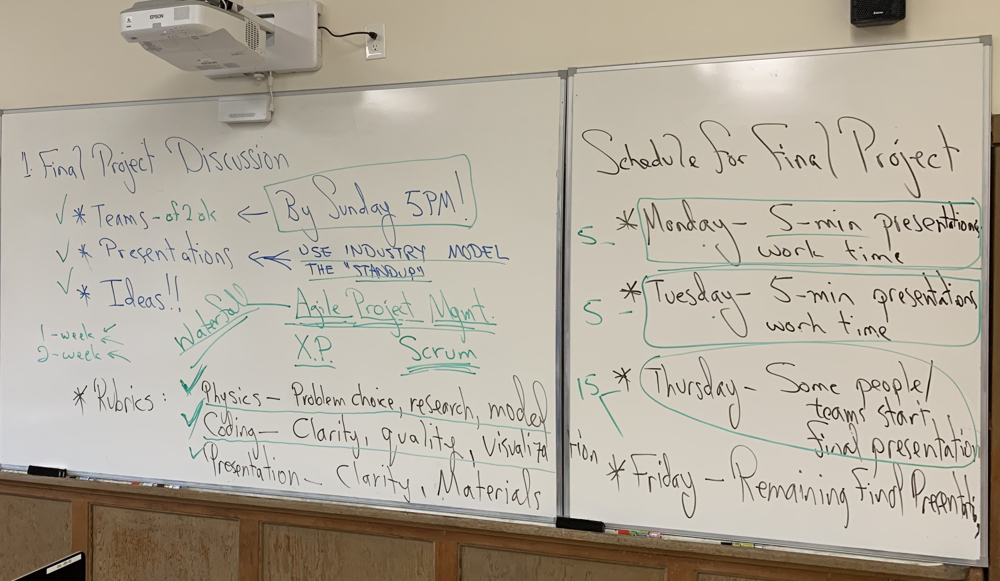

# Loops and Orbits &mdash; Final Projects Plan

* Jump to [Final Project Teams](./teams.md)
* Return to [Syllabus](http://physics.stmarys-ca.edu/faculty/brianhill/courses/Jan033/20J/index.html)

## Overview

We will run the final projects like a week-long sprint. Your part of the product is a notebook that extends any of the work we have done this semester, and a presentation explaining that notebook to your classmates at the end of the week.

We will have standups on Monday and Tuesday. Standups are designed to help everyone focus on making progress toward completion of their part of a product.

In an industry setting a significant goal of the standup is to inform the product manager and other team members what coordination is necessary for the team to make the maximum progress. In our more academic setting, it gives everyone else in the class the forward-looking status of your work, and gives you a chance to practice discussing your topic, the theory of your model, and the notebook code that implements it.

## Schedule / Goals / Rubric

### First Standup

1. Explain your topic in terms the rest of the class can understand.
2. Explain your uncertainties in your choice of topic and how to proceed.
3. Give a forward-looking status: principally, what do you plan to do between now and the next standup.
4. Is there any way in which you are blocked and can use help from your classmates in getting unblocked?
5. If you are blocked, no step is to small to get unblocked.

### Second Standup

1. Remind people of your topic.
2. Explain where you currently are on your topic. The explanation should be just enough so that people can understand what you are going to try next.
3. Give a forward-looking status: principally, what do you plan to do between now and the final presentation?
4. Explain uncertainties in your plan for how to proceed.
5. Highlight any ways in which you feel you are blocked and can use help.

### Final Presentations

If you are presenting on Thursday, email me your notebook during the middle of Thursday's class. I will load all three of them up on my laptop so that you can step through and show your notebook on the front screen using AirPlay.

Thursday presenters:

* Gaby/Andy
* Laura/Valentin
* Nancy/Ausmitha

If you are presenting on Friday, email me your notebook at the end of day on Thursday. We will start Friday's class right away with presentations. I will load all eight of them loaded up on my laptop so that you can step through and show your notebook on the front screen using AirPlay.

Friday presenters:

* Hunter
* Cindy (with Kyle?)
* Venessa/Jack
* Mackade
* Matt/Nicolo
* Ryan/Ronnie
* Peter/Theo
* Kevin
