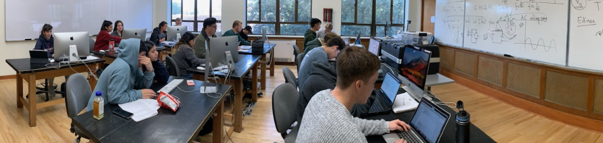

# Loops and Orbits &mdash; Final Project Teams

## Links

* Jump to [Final Projects Plan](./plan.md)
* Return to [Syllabus](http://physics.stmarys-ca.edu/faculty/brianhill/courses/Jan033/20J/index.html)

## *Three Presentations Starting 11:00 on Thursday*

## Gaby and Andy &mdash; Tennis Topspin

[Gaby and Andy, Tennis Topspin](./gaby_andy/tennis_topspin.md)

## Laura and Valentin &mdash; Biceps Power

[Laura and Valentin, Biceps Power](./gaby_andy/biceps_power.md)

## Nancy and Ausmitha &mdash; Portfolio Depreciation

[Nancy and Ausmitha, Portfolio Depreciation](./nancy_ausmitha/portfolio_depreciation.md)

## *Remaining Eight Presentations Starting 9:15am on Friday*

## Hunter &mdash; RC Circuit with AC Supply

[Hunter, RC Circuit with AC Supply](./hunter/rc_circuit_ac_supply.md)

With the resistor-capacitor combination, we can swap out the DC (direct current) voltage source and put in an AC (alternating current) voltage source. The resistor-capacitor combination is called an "RC" circuit.

I'll be doing an RC circuit with an AC voltage source. It turns out you can make both a low-pass filter and a high-pass filter out of an RC circuit. The Jupyter notebook will study high-pass and low-pass filters made from RC circuits.

### Hunter Standup 1

First steps will be to code up the alternating current function.

### Hunter Standup 2

Yesterday got all the formulas and values into the code. Alternating current function. 1000 Hz is the medium frequency.

Low frequency (200 Hz), medium frequeny, and high frequency (5000 Hz).

## Cindy &mdash; Student Body Mood

[Cindy, Student Body Mood](./cindy/student_body_mood.md)

## Venessa and Jack &mdash; Basketball Swisher

[Venessa and Jack, Basketball Swisher](./venessa_jack/basketball_swisher.md)

## Mackade &mdash; Extending Solow-Swan

[Mackade, Extending Solow-Swan](./mackade/extending_solow_swan.md)

## Matt and Nicolo &mdash; Kepler's 2nd Law

[Matt and Nicolo, Kepler's 2nd Law](./matt_nicolo/keplers_2nd_law.md)

## Ryan and Ronnie &mdash; Golf Ball Lift

[Ryan and Ronnie, Golf Ball Lift](./ryan_ronnie/golf_ball_lift.md)

## Kevin &mdash; Voyager Slingshot

[Kevin, Voyager Slingshot](./kevin/voyager_slingshot.md)

## Peter and Theo &mdash; Apollo 13 Free Return

[Peter and Theo, Apollo 13 Free Return](./peter_and_theo/apollo_13_free_return.md)
