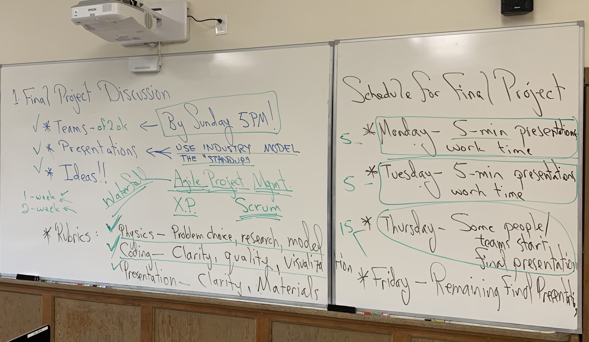

# Loops and Orbits &mdash; Final Projects

Return to [Syllabus](http://physics.stmarys-ca.edu/faculty/brianhill/courses/Jan033/20J/index.html)

## Schedule / Goals / Rubric

### Goals for Standups

Your "product" is a notebook that extends any of the work we have done this semester, and a presentation explaining that notebook to your classmates at the end of this week.

The standup is designed to help everyone focus on making progress toward completion of the product. In an industry setting a significant goal of the standup is to inform the product manager and other team members what coordination is necessary for the team to make the maximum progres.

1. Explain your topic in terms the rest of the class can understand.
2. Explain your uncertainties in your choice of topic and how to proceed.
3. Give a forward-looking status: principally, what do you plan to do between now and the next standup (or the final presentation)?
4. Is there any way in which you are blocked and can use help from your classmates in getting unblocked.
5. If you are blocked, remember, no step is to small to get unblocked. Google the topic. Figure out which notebook you have already studied is the closest. Identify constants that go into the model. Etc.

## Teams

### Gaby and Andy

Forehand spin &mdash; topspin &mdash; of a tennis ball. Reference: Cross and Lindsey, "Measurements of drag and lift on tennis balls in flight," Sports Engineering (2014) **17**, 89-96.

#### Notes on Standup 1

### Hunter

With the resistor-capacitor combination, we can swap out the DC (direct current) voltage source and put in an AC (alternating current) voltage source. The resistor-capacitor combination is called an "RC" circuit. I'll be doing an RC circuit with an AC voltage source. It turns out you can make both a low-pass filter and a high-pass filter out of an RC circuit. The Jupyter notebook will study high-pass and low-pass filters made from RC circuits.

#### Notes on Standup 1

### Cindy

Modeling the spread of depression and anxiety in a population of students during the course of the semester. The model is not intended to be realistic. Possibly it could be made realistic. Consultant on project, senior in psychology, kk29@stmarys-ca.edu.

#### Notes on Standup 1

### Laura and Valentin

From the field of kinesiology: Power curve analysis of different Biceps exercises in comparison to the Biceps power curve. We take different Bizeps exercises and calculate the power curve based on the force (gravity) and then compare it to the power curve of the Bizeps itself.

#### Notes on Standup 1

### Venessa and Jack

#### Notes on Standup 1

### Mackade

Extending the Solow-Swan economic model.

#### Notes on Standup 1

### Matt and Nicolo

Proving that Kepler's 2nd Law (equal areas in equal times) works.

#### Notes on Standup 1

### Ryan and Ronnie

We will examine the spin of a golf ball and the forces of a golf ball in flight. We’ve looked at some websites with research about it, and we think we can model a golf ball flight. Brian suggests: look into whether a 3-D view is possible -- in which case slicing the ball to the left or right would be very cool.

#### Notes on Standup 1

### Nancy and Ausmitha

Asset depreciation. Depreciation models (one or more of straight line, accelerated, or compounding percentage). Reinvestment. Portfolio with multiple assets and asset classes.

#### Notes on Standup 1

### Peter and Theo

We have decided to make a simulation of a rocket orbiting earth and have it slingshot around the moon and come back to earth.

#### Notes on Standup 1

### Kevin

???

#### Notes on Standup 1

### Peter

??

#### Notes on Standup 1
