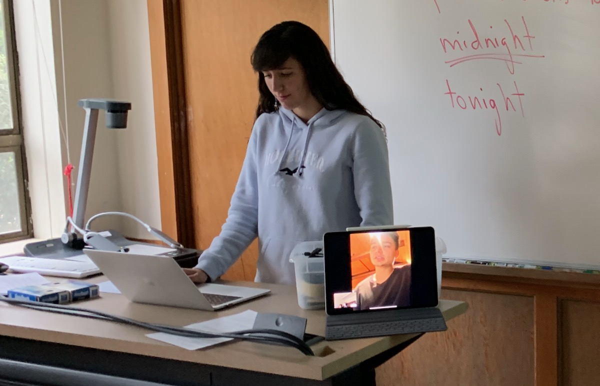
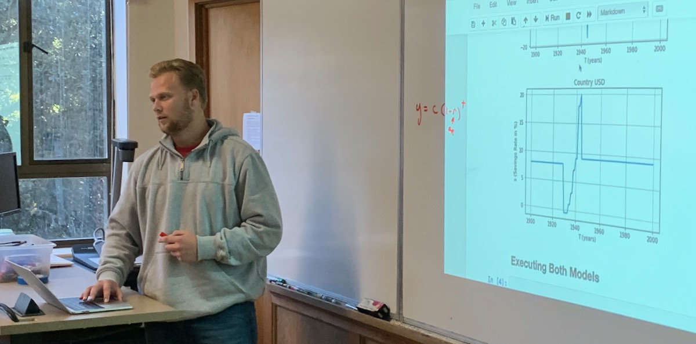
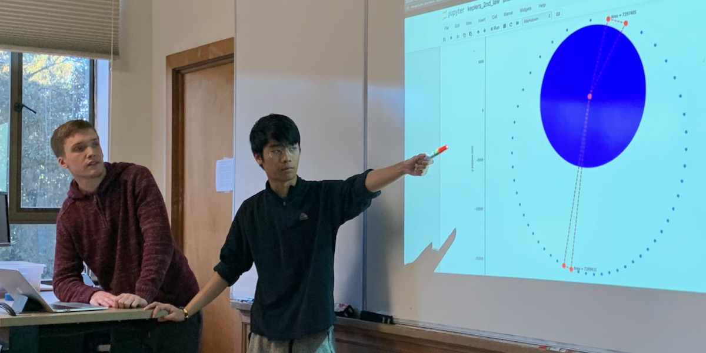

# Loops and Orbits — Final Project Teams

## Links

* Jump to [Final Projects Plan](./plan.md)
* Jump to [Syllabus](http://physics.stmarys-ca.edu/faculty/brianhill/courses/Jan033/20J/index.html)
* Return to [Loops and Orbits Home](../README.md)

## *Three Presentations Starting 11:00am on Thursday*

### Gaby and Andy — Tennis Topspin

Forehand spin — topspin — of a tennis ball. Reference: Cross and Lindsey, "Measurements of drag and lift on tennis balls in flight," Sports Engineering (2014) **17**, 89-96.

#### Python Code

* [Tennis Topspin Notebook](./tennis_topspin.ipynb)

### Laura and Valentin — Biceps Power

From the field of kinesiology: Power curve analysis of different Biceps exercises in comparison to the Biceps power curve. We take different Biceps exercises and calculate the power curve based on the force (gravity) and then compare it to the power curve of the Biceps itself.

#### Python Code and Presentation Documentation

* [Biceps Power Notebook](./biceps_power.ipynb)
* [Biceps Power PDF](./biceps_power.pdf)

### Nancy and Ausmitha — Portfolio Depreciation

Asset depreciation. Depreciation models (one or more of straight line, accelerated, or compounding percentage).

Portfolio with multiple assets and asset classes.

Stretch goal: reinvestment.

#### Python Code

* [Straight-Line Depreciation Notebook](./straight_line_depreciation.ipynb)
* [Units of Production Notebook](./units_of_production.ipynb)

## *Eight Presentations Starting 9:30am on Friday*

### Hunter — RC Circuit with AC Supply

With the resistor-capacitor combination, we can swap out the DC (direct current) voltage source and put in an AC (alternating current) voltage source.

The resistor-capacitor combination is called an "RC" circuit.

I'll be doing an RC circuit with an AC voltage source. It turns out you can make both a low-pass filter and a high-pass filter out of an RC circuit.

The Jupyter notebook will study high-pass and low-pass filters made from RC circuits.

#### Python Code

* [RC Circuit with AC Supply Notebook](./rc_circuit_ac_supply.ipynb)

### Cindy — Student Body Mood

Modeling the spread of depression and anxiety in a population of students during the course of the semester. The model is not intended to be realistic. Possibly it could be made realistic. Consultant on project: Senior in Psychology, Kyle Krantz.

#### Python Code

* [Student Body Mood Notebook](./student_body_mood.ipynb)

### Venessa and Jack — Basketball Swisher

Our plan is to map out the path of a basketball. Focusing on the range of initial conditions which are mostly to result in a basket. Reflection off of the backboard.

Work with the angles depending on a set distance from the hoop. Lots of different trajectories can go through hoop.

#### Python Code

* [Basketball Swisher Notebook](./basketball_swisher.ipynb)

### Mackade — Extending Solow-Swan

Extending the Solow-Swan economic model.

#### Python Code

* [Extending Solow-Swan Notebook](./extending_solo_swan.ipynb)

### Matt and Nicolo — Kepler's 2nd Law

Proving that Kepler's 2nd Law (equal areas in equal times) works.

Produce a visualization of the equal areas law of Kepler's three laws.

Start from the Newton's Cannon notebook.

#### Python Code

* [Kepler's 2nd Law Notebook](./keplers_2nd_law.ipynb)

### Ryan and Ronnie — Golf Ball Flight

We will examine the spin of a golf ball and the forces of a golf ball in flight. We’ve looked at some websites with research about it, and we think we can model a golf ball flight. Brian suggests: look into whether a 3-D view is possible -- in which case slicing the ball to the left or right would be very cool. There are radar sensing measurements and models.

#### Python Code

* [Golf Ball Lift Notebook](./golf_ball_flight.ipynb)

### Kevin — Voyager Slingshot

Model of a satellite leaving Earth and slingshotting to the outer planets and then out of the Solar system.

#### Python Code

* [Voyager Slingshot Notebook](./voyager_slingshot.ipynb)

### Peter and Theo — Apollo 13 Free Return

We have decided to make a simulation of a rocket taking off from earth and have it slingshot around the moon and come back to earth.

#### Python Code

* [Apollo 13 Free Return Notebook](./apollo_13_free_return.ipynb)
