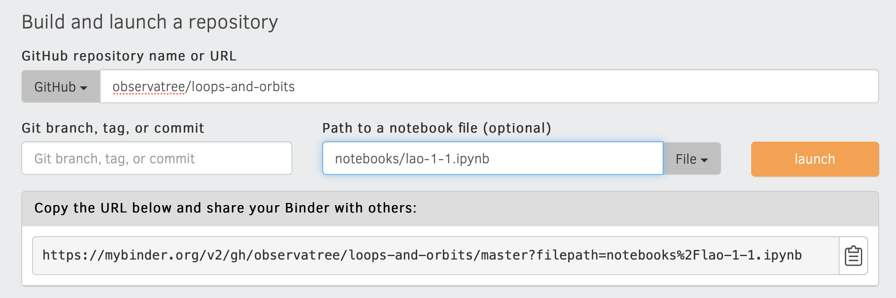

# Resources and References for JAN-033, Loops and Orbits, January, 2020

## Physics &amp; Math

### Computational Physics

* Numerical Methods for Physics, Alejandro L. Garcia, Pearson, 1994, [Used on AbeBooks.com](https://www.abebooks.com/products/isbn/9780131519862)

## Computer Science
	
Suppose all sorts of people that knew how to cook ran all the restaurants, and that most of them actively avoided aquiring expertise in personnel management and food safety, and further that there were no city and county health departments to license the restaurants. That's the current state of software, except cooking is programming, personnel management is project management, and food safety is quality control and security.

That said, the wild west state of affairs is a good thing for continued rapid innovation in software.
	
### Programming

* The fastest way to learn to program is to Learn Python 3 The Hard Way (LP3THW). Python 2 is rapidly becoming obsolete. You should not consider learning it at this point.
* Eventually you'll want to get the paid PDF, but enough of LP3THW is on the web in HTML to get a good start: (https://learnpythonthehardway.org/python3](LP3THW by Zed Shaw).
	
### Change Management

* Software is complex and easily editable. These two facts make change management essential. The most popular change management system is git. It is far superior to the systems that preceded it (CVS and Subversion).
* If you want to understand git instead of just memorizing the most common commands, read Travis Swicegood's [https://pragprog.com/book/pg_git/pragmatic-guide-to-git](Pragmatic Guide to Git)
* After you have used git for a couple of months, take a deep dive into how it works: [https://git-scm.com/book/en/v2/Git-Internals-Git-Objects](Git Objects)

## Python Laboratory
	
We need an environment where we can put the physics, math, and software together without spending an inordinate amount of time building up the basics. Our environment is Jupyter and VPython. Jupyter can be run on-line without installing any software using Binder, and that will get us started quickly. We can install the software to run Jupyter and Python later.
	
### Jupyter

* The <a href="https://www.dataquest.io/blog/jupyter-notebook-tutorial/">Jupyter tutorial for beginners</a> by Benjamin Pryke.

### Making Binder Notebook URLs

* How are the notebook URLs in the detailed schedule made? Go to <a href="mybinder.org">mybinder.org</a>.
* Enter notebook info as shown in the screenshot below and then click launch.

	
	
### VPython

* Directions for <a href="https://vpython.org/presentation2018/install.html">installing Jupyter and VPython</a>.</li>
	
## README

* Return to top-level [README](./README.md)
